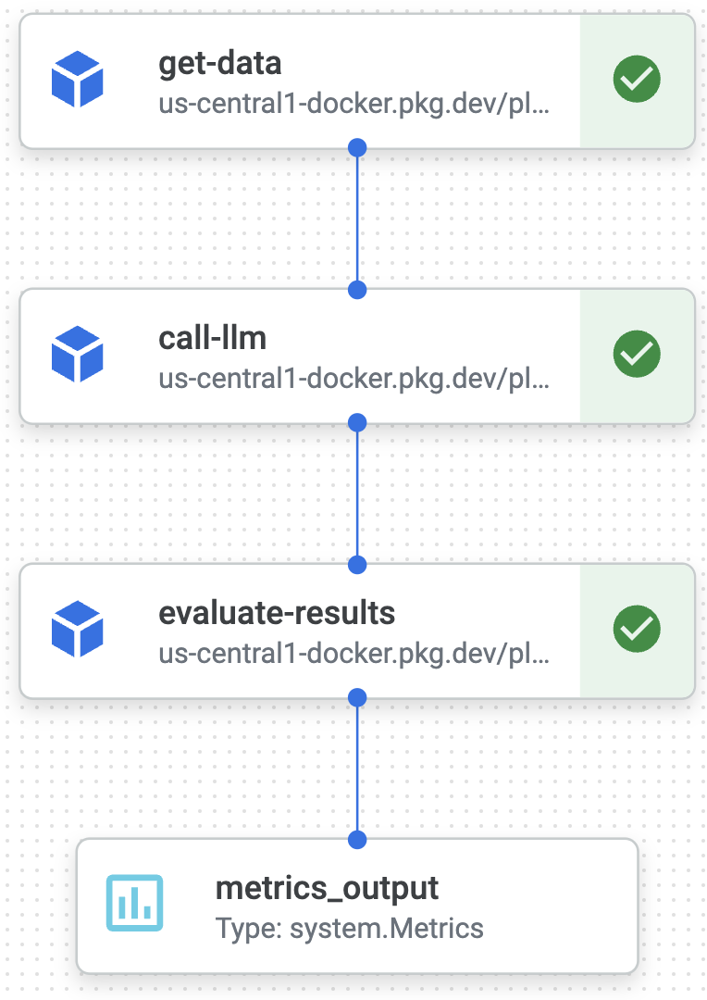
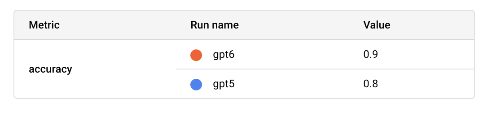

# LLM pipelines demo


End-to-end local and remote pipelines with Kubeflow and Vertex AI.
<p align="center">

</p>

👉 This repo is a companion to [this blog post]([medium.com/p/1b688dcebee5/edit](https://medium.com/@lukicov/ml-pipelines-in-the-age-of-llms-from-local-containers-to-cloud-experiments-1b688dcebee5)

# Setup

First, [**install uv**](https://docs.astral.sh/uv/getting-started/installation/), then download Python `3.12.7`:
```shell
uv python install 3.12.7
```
update the project's environment
```shell
uv sync
```
and activate the virtual environment
```shell
source .venv/bin/activate
```

### Google Cloud ☁️
If you haven't already, [create a Google Cloud account and project](https://console.cloud.google.com/getting-started),
then [install the Google Cloud SDK](https://cloud.google.com/sdk/docs/install) `gcloud`, and authenticate with GCP:
```shell
gcloud auth login --update-adc
```

- Navigate to, and click to enable any necessary APIs, in [Vertex AI Pipelines](https://console.cloud.google.com/vertex-ai/pipelines).

- Then in the IAM, [create a new service account (SA)](https://console.cloud.google.com/iam-admin/serviceaccounts) `demo-sa` with the following roles:
```
Artifact Registry Writer
Cloud Build Editor
Storage Admin
Storage Object Admin
Vertex AI User
````

- Create a new Docker repository `demo-repo` in `us-central1` region in the [Artifact Registry](https://console.cloud.google.com/artifacts).

- Finally,  add your project ID (e.g. `plasma-set-442915-a1`), repository name and SA name to `pipelines/config.cfg`:
```
[job_constants]
gcp_project = plasma-set-442915-a1
sa_name = demo-sa
repo_name = demo-repo
```

### Docker 📦
Ensure you have [**Docker Desktop**](https://www.docker.com/products/docker-desktop/) installed and running.


# Local pipeline with Kubeflow
Build a local container with
```shell
build-local
```
then trigger a local pipeline with
```shell
run-local
```

The pipeline outputs are saved in `./local_outputs/`, and you should see the following output in your terminal:
```shell
metadata={'accuracy': 1.0}
----------------------------------------------------
INFO - Pipeline 'demo' finished with status SUCCESS
```

# Remote pipeline on Vertex AI
Build a remote container with Cloud Build (if prompted, enable the API in your terminal):
```shell
build-remote
```
and trigger a remote pipeline with
```shell
run-remote
```
then *CMD+click* on the link in your terminal (`View Pipeline Job:`) to view the pipeline in the Vertex AI console:

<p align="center">

</p>


## Experiment tracking
The contents of `metrics_output` are logged into Vertex AI's [Experiment Tracking](https://console.cloud.google.com/vertex-ai/experiments) as part of our `demo-experiment`, such that we can compare `accuracy` values for multiple pipelines side-by-side in the console:

<p align="center">

</p>

or programmatically:
```shell
fetch-metrics
```
```shell
0  gpt6 0.9
1  gpt5 0.8
```

# Extending our pipeline
The next steps are to extend our pipeline components from a demo to a fully-fledged LLM-cruncher 😎:
- `get_data`: [Fetch data (e.g. prompts) from BigQuery](https://cloud.google.com/python/docs/reference/bigquery/latest)
- `call_llm`: [Make a call to gpt-4o](https://platform.openai.com/docs/guides/text-generation)
- `evaluate_results`: [Getting Started with OpenAI Evals](https://cookbook.openai.com/examples/evaluation/getting_started_with_openai_evals)
- Configuration for pipeline parameters: [use Pydantic to load and validate your config.yaml file](https://docs.pydantic.dev/latest/api/pydantic_settings/#pydantic_settings.YamlConfigSettingsSource)
