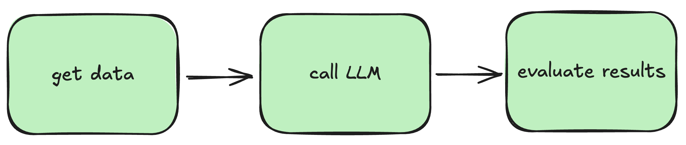

# LLM pipelines demo 

Demo of local and remote pipelines for calling and evaluating LLMs using Kubeflow and Vertex AI.



👉 This repo is a companion to this blog post [medium.com/p/1b688dcebee5/edit](medium.com/p/1b688dcebee5/edit)

# Setup 

Install `uv`: https://docs.astral.sh/uv/getting-started/installation/

Download Python `3.12.7`:
```shell
uv python install 3.12.7
```
update the project's environment 
```shell
uv sync
```
and activate the virtual environment
```shell
source .venv/bin/activate
```

# Local pipeline with Kubeflow


# Remote pipeline on Vertex AI


